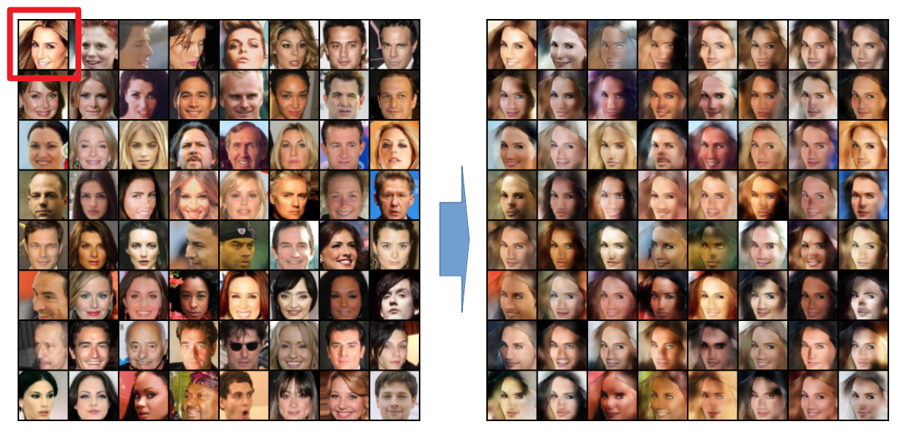

# Feature-Subtraction-using-AE-GAN
implement Feature subtraction/style transfer using Conditional AutoEncoder-GAN combined model

### MNIST STYLE TRANFER
- random MNIST number to number 5   
    
- random MNIST number to number 4      

### Description

Every data is comprised of subset of information. For instance, speech data is mixture of phonetic, language, speaker and so on. Image data is mixture of sketch, color, style and so on.     
Question is "Is it possible to subtract a subset of information from the data and store the rest of it?". I propose a method to subtract certain information from data and prove it by reconstructing the rest of information with any other data.    

### Model Structure
The purpose of this model is to get data information - condition information in the bottle neck part of AE. I combined two models AutoEncoder and GAN,and added conditioning for both of the model. My hypothesis is conditioning works as subtraction in Encoder part of AE, and works as Addition in Decoder part of AE. GAN gets the hidden dimmension in bottle neck of AE as a latent vector(noise).    
- Model structure for training    

- Model structure for inference, applying different condition for style transfer    

### Prior work
There was a trial to combine Auto-Encoder and GAN in the paper https://arxiv.org/abs/1512.09300, know as VAE-GAN. The purpose of this research is to disentangle features in latent domain of GAN, which is different with my research. One of the post work of this research is "CVAE-GAN: fine-grained image generation through asymmetric training." by Bao, Jianmin, et al. This works also combined conditioning with VAE-GAN but focused on disentanglement in latent domain for conditioned generation. Focus of my research is proving autoencoder functions as a subtraction encoder and applying style transfer with this model.    

### Additional Result (Not included in code above, but same model with same process)
I propose my model can be used not only for MNIST data, but also for the Real images with Sketch/Color conditions.    

- grey images is used as condition, All the color is tranferred to first image.

- sketch images is used as condition, All the sketch is tranferred to first image.

